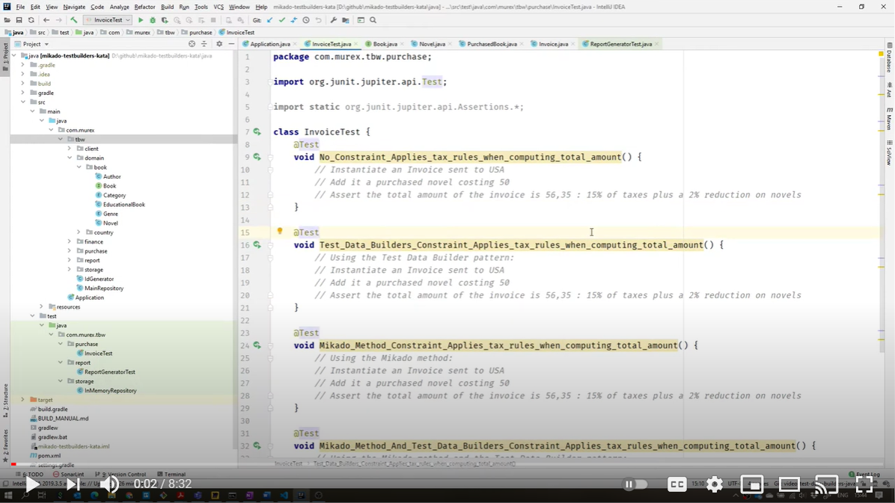

# Building Test Data

Let's try to improve the following:
* Our tests contain a lot of duplication
* Setting up data for our tests was long and painful

## Present Test Data Builders


*[Image Source](https://pixabay.com/photos/child-tower-building-blocks-blocks-1864718/)*

[Test Data Builders](./references/Test_Data_Builders.md) are particularly
handful to build test data. They should help us here.

You'll find resource about Test Data Builders 
[here](./references/Test_Data_Builders.md) or on your room walls.

### Rapid Response Question

> As a group, what are the top 5 most important things about the Test Data
> Builders?

## Live code the beginning of the Test Data-Builders here

To help you to get started, here is a demo of how to use the Test Data-Builders in
our particular situation.

[](https://www.youtube.com/watch?v=TpOmhDZgEKc&feature=youtu.be)

### Video Screen Shots

#### Code Snippets

<details>
  <summary markdown='span'>
  Code Snippets of NovelTestDataBuilder from the video
  </summary>

##### NovelTestDataBuilder.java 

  ```java
  package com.murex.tbw.domain.book;
  
  import com.google.common.collect.Lists;
  import com.murex.tbw.domain.country.Language;
  
  public class NovelTestDataBuilder {
      private double price = 10;
  
      public static NovelTestDataBuilder aNovel() {
          return new NovelTestDataBuilder();
      }
  
      public NovelTestDataBuilder costing(double price) {
          this.price = price;
          return this;
      }
  
      public Novel build() {
          return new Novel("Test Data Builders for Dummies", price, null, Language.ENGLISH, Lists.newArrayList());
      }
  }
  ```
</details>

<details>
  <summary markdown='span'>
  Code Snippets of InvoiceTest from the video
  </summary>

##### InvoiceTest.java

  ```java
  package com.murex.tbw.purchase;
  
  import com.murex.tbw.domain.book.NovelTestDataBuilder;
  import org.junit.jupiter.api.Assertions;
  import org.junit.jupiter.api.Test;
  
  import static org.junit.jupiter.api.Assertions.*;

  class InvoiceTest {
      @Test
      void Test_Data_Builders_Constraint_Applies_tax_rules_when_computing_total_amount() {
          Invoice invoice = InvoiceTestDataBuilder.anInvoice()
                  .from(USA)
                  .with(PurchasedBookTestDataBuilder.aPurchasedBook()
                          .of(NovelTestDataBuilder.aNovel()
                                  .costing(50.0)
                                  .build())
                          .build())
                  .build();
          Assertions.assertEquals(50 * 1.15 * 0.98, invoice.computeTotalAmount());
      }
  }
  ```

</details>

## DIY

Now that you know everything about Test Data Builders, try to use them to
improve your tests.

### Delete the tests

In real life, you would

1. Fix the bugs
2. Use test data-builders to instantiate your test data. 

So let's Ignore or Comment-Out the previous tests!

### Use Test-Data-Builders to setup the data for a test on Invoice

We'll first focus on testing the Invoice ([java](../java/src/main/java/com/murex/tbw/purchase/Invoice.java) | [c++](../cpp/src/include/purchase/Invoice.h) | [c#](../csharp/Application/Purchase/Invoice.cs) | [kotlin](../kotlin/src/main/kotlin/com/murex/tbw/purchase/Invoice.kt) | [scala](../scala/src/main/scala/com/murex/tbw/purchase/Invoice.scala)) class.
It's simpler and achievable given the time we have.

To solve this section, use the test entitled *Test_Data_Builders_Constraint_Applies_tax_rules_when_computing_total_amount*!

Use the test data-builder to instantiate your objects in the test.

### Use Test-Data-Builders to setup the data for a test on Report Generator (advanced)

If you have the time, repeat the same exercise with the test on ReportGenerator ([java](../java/src/main/java/com/murex/tbw/report/ReportGenerator.java) | [c++](../cpp/src/include/report/ReportGenerator.h) | [c#](../csharp/Application/Report/ReportGenerator.cs) | [kotlin](../kotlin/src/main/kotlin/com/murex/tbw/report/ReportGenerator.kt) | [scala](../scala/src/main/scala/com/murex/tbw/report/ReportGenerator.scala)) class.

## Mini-retro

Time for a mini-retro again.

Take a few minutes to discuss the good and the bad of this approach.

Then compare them to what people usually say in
the [Retrospectives Guide](./Retrospectives_Guide.md)

----
Continue:
- [Try the Mikado Method to setup your test data incrementally](./4_Mikado_Method.md)
- [If you already know the Mikado Method, try to combine it with Test Data Builders](./5_Mikado_Method_plus_Test_Data_Builders.md)
