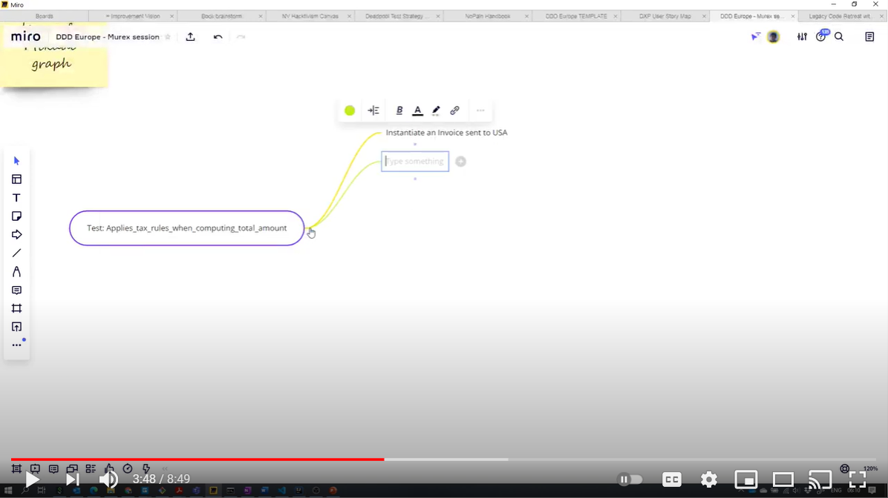
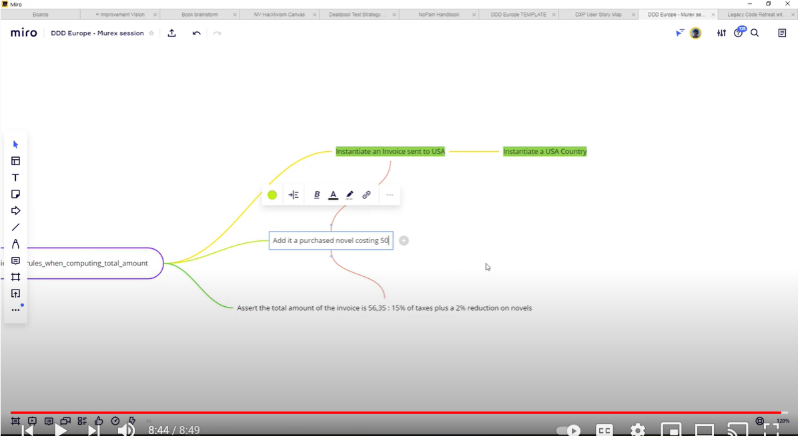

# Mikado Method

Setting up test data for your first test takes a lot of time.
That's not going to help us to test our bugs in legacy code!
Let's try the Mikado Method to:
- be able to setup this test data step by step
- spread this work over many days, weeks, and people

## Present the Mikado Method


*[Image Source](https://pixabay.com/photos/mikado-play-puzzle-skill-colorful-1743593/)*

The [Mikado Method](./references/The_Mikado_Method.md) is a technique to
incrementally do large refactorings, alongside feature delivery.

You'll find resource about the Mikado Method 
[here](./references/The_Mikado_Method.md) or on your room walls.

### Rapid Response Question

> As a group, what are the top 5 most important things about the the Mikado
> Method?

## Live code the beginning of the Mikado Graph here

To help you to get started, here is a demo of how to use the Mikado Method in
our particular situation.

[](https://www.youtube.com/watch?v=losyrW6g0JY&feature=youtu.be)

### Video Screen Shots 

#### Mikado Graph

<details>
  <summary  markdown='span'>
  Screen-shot of the Mikado Graph from the video
  </summary>
  
</details>

#### Code Snippets 

<details>
  <summary markdown='span'>
  Code of InvoiceTest from the video
  </summary>

  ```java
    @Test
    void Mikado_Method_Constraint_Applies_tax_rules_when_computing_total_amount() {
        Country usa = new Country("USA", Currency.US_DOLLAR, Language.ENGLISH);
        Invoice invoice = new Invoice("Joe", usa);
    }
    
  ```
</details>

## DIY

Now that you have a better idea, grab a whiteboard, a marker, some post-its and
start creating your own mikado graph to add a test.


*[Image Source](https://pixabay.com/photos/workshop-pens-post-it-note-2209239/)*

### Delete the tests

In real life, you would

1. Fix the bugs
2. Start the mikado method to setup your test data

So let's delete the tests!

### Use Mikado Method to setup data for a test on Invoice

We'll first focus on the test on [Invoice](../java/src/main/java/com/murex/tbw/purchase/Invoice.java). It's simpler
and achievable given the time we have.

Write your test as if you could instanciate your objects, and start to draw your mikado graph.

Make sure your project keeps building all the time. Notice every time you have something useful.

### Use Mikado Method to setup data for a test on Report Generator (advanced)

If you have the time, repeat the same exercise with the test on [ReportGenerator](../java/src/main/java/com/murex/tbw/report/ReportGenerator.java)

## Mini-retro

Time for a mini-retro again.

Take a few minutes to discuss the good and the bad of this approach.

Then compare them to what people usually say in
the [Retrospectives Guide](./Retrospectives_Guide.md)

----
Continue:
- [Try Test Data Builders to improve test data setup](./3_Building_Test_Data.md)
- [If you already master Test Data Builders, try to combine them with the Mikado Method](./5_Mikado_Method_plus_Test_Data_Builders.md)
