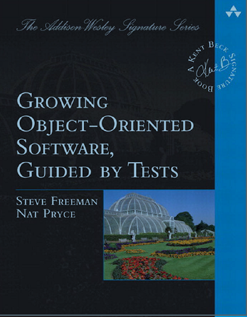

# Test Data Builders



[Copyright:[Growing Object-Oriented Software, Guided by Tests](http://www.informit.com/store/growing-object-oriented-software-guided-by-tests-9780321503626), 
by [Nat Pryce](http://natpryce.com/bio.html) and [Steve Freeman](https://www.higherorderlogic.com/)]

## Summary

'Test Data Builders' is a technique that leverages on the [Builder Pattern](https://en.wikipedia.org/wiki/Builder_pattern#Java) 
to construct complex objects in tests.  
With 'Test Data Builders' we can omit fields or properties that do not 
contribute to the behavior of the object being tested.  
A test data builder class has the following features: 

1. A field for each constructor parameter 
1. The fields are initialized to a default safe value
1. Fluent public methods to override the default values
1. A 'build' method that returns an instance of object initialized with 
the fields' values. 

## Examples

Below is an example of a TestBuilder for the Country object from our code:

```java
    import static com.murex.tbw.domain.country.Currency.US_DOLLAR;
    import static com.murex.tbw.domain.country.Language.ENGLISH;
    
    public class CountryTestBuilder {
        private String name = "";
        private Currency currency = US_DOLLAR;
        private Language language = ENGLISH;
    
        public static CountryTestBuilder aCountry() {
            return new CountryTestBuilder();
        }
    
        public CountryTestBuilder withName(String name) {
            this.name = name;
            return this;
        }
    
        public CountryTestBuilder withCurrency(Currency currency) {
            this.currency = currency;
            return this;
        }
    
        public CountryTestBuilder withLanguage(Language language) {
            this.language = language;
            return this;
        }
    
        public Country build() {
            return new Country(name, currency, language);
        }   
    }
```

By using the above builder, we can now easily create a country instance 
for France with this code: 
> Note that using the static imports made our code even clearer and shorter    

```java
    import static com.murex.tbw.domain.country.Currency.US_DOLLAR;
    import static com.murex.tbw.domain.country.Language.ENGLISH;
    import static com.murex.tbw.domain.country.CountryTestBuilder.aCountry;
    
    @Test
    public void test() {
        Country france = aCountry()
                .withName("France")
                .withCurrency(EURO)
                .withLanguage(FRENCH)
                .build();
    }
```

## Best Practices 
### Where to place the Test Data Builders?
There is no definite answer for that. But, as mentioned earlier, the Test Data
Builder is based on the Builder pattern. In general, it is better to have the 
builder next to the class it is building.   
Thus, with Test Data Builders, it would be better for our builders to be in the
same package/namespace as a real class, but in the test structure.
to its tests. 

## Benefits

Mainly, Test Data Builders helps us create tests that are expressive and 
more resilient to change. Test Data Builders achieve this by: 

1. Wrapping up most of the syntax noise when creating new objects 
1. Making the default case simple, and special cases not much complicated
1. Protecting tests against changes in the object structure. Existing tests
will not fail if new fields were added to existing objects.
1. Making test code more readable and easier to spot the errors
1. Removes a lot of duplication between tests 
1. Makes writing new tests easier 


## Advanced Usage 

### Creating Similar Objects 
Test Data Builders can help create similar objects in a cleaner way. 

For example, assume we want to create country instances for France and Germany. 
Knowing that both have Euro as a currency, we can do the following: 

```java
    import static com.murex.tbw.domain.country.Currency.US_DOLLAR;
    import static com.murex.tbw.domain.country.Language.ENGLISH;
    import static com.murex.tbw.domain.country.CountryTestBuilder.aCountry;
    
    @Test
    public void test() {
        CountryTestBuilder europeCountryBuilder = aCountry().withCurrency(EURO);

        Country france = europeCountryBuilder
                .withName("France")
                .withLanguage(FRENCH)
                .build();

        Country germany = europeCountryBuilder
                .withName("Germany")
                .withLanguage(GERMAN)
                .build();
    }
```

In most cases with more complex code, this approach will also help get rid of 
duplicated code in tests!

### Passing Builders as Parameters 
We can also pass Test Data Builders as parameters to other Test Data Builders. 

For example, the Author class has Country as one of its fields. Thus, its 
builder class should contain an instance of the respective Country as well. 
Instead of passing an instance of Country as parameter to the withCountry 
method, we can pass an instance of CountryTestBuilder as shown below: 

```java
    public class AuthorTestBuilder {
        private String name = "";
        private CountryTestBuilder countryTestBuilder;
    
        public static AuthorTestBuilder anAuthor() {
            return new AuthorTestBuilder();
        }
    
        public AuthorTestBuilder withName(String name) {
            this.name = name;
            return this;
        }
    
        public AuthorTestBuilder withCountry(CountryTestBuilder countryTestBuilder) {
            this.countryTestBuilder = countryTestBuilder;
            return this;
        }
    
        public Author build() {
            return new Author(name, countryTestBuilder.build());
        }
    } 
```

Here is an example of how to build an instance of the Author class:

```java 
    @Test 
    public static void test() {
        Author author = anAuthor()
                .withName("Victor Hugo")
                .withCountry(aCountry()
                        .withName("France")
                        .withCurrency(Currency.EURO)
                        .withLanguage(Language.FRENCH))
                .build();
    }
```

## Variations

### Test Constants
Another approach that can help reduce duplication in the tests is by using 
Tests Constants. Those constants can be initialized: 
1. using the Test Data Builder or calling constructor directly 
1. in a separate class or the Test Class itself.

For example, we can initialize the instances of France and Germany this way:

```java
    import static com.murex.tbw.domain.country.Currency.EURO;
    import static com.murex.tbw.domain.country.Language.GERMAN;
    import static com.murex.tbw.domain.country.CountryTestBuilder.aCountry;
    
    public final class TestConstants {
        public final Country FRANCE = new Country("France", EURO, Language.FRENCH);
        
        public final Country GERMANY = aCountry()
                .withName("Germany")
                .withCurrency(EURO)
                .withLanguage(GERMAN)
                .build();
    }
```

### Wrapping dependencies in small test objects

Objects in legacy code are often very messy! It is very common to have an
object you need to instantiate in your test doing some problematic side
effect in its constructor. Loading something from the DB is the canonical
example. We cannot use Test Data Builders by the book in this situation.

We have a small example of this in this codebase, with the [ReportGenerator](../../java/src/main/java/com/murex/tbw/report/ReportGenerator.java)
constructor calling the [MainRepository](../../java/src/main/java/com/murex/tbw/MainRepository.java)
singleton directly.

Here's a technique inspired from [Working Effectively with Legacy Code](https://www.r7krecon.com/legacy-code), by [Michael C. Feathers](https://www.r7krecon.com/)

* Find a place where you can inject a different implementation (here,
  [Repository](../../java/src/main/java/com/murex/tbw/storage/Repository.java))
* Write an in-memory fake implementation of this implementation (here, it
  already exists in [InMemoryRepository](../../src/test/java/com/murex/tbw/storage/InMemoryRepository.java))
* Inject it before the test

```java
    @BeforeEach public void
    setUp() {
         MainRepository.override(new InMemoryRepository());
    }
```

* Remove the fake after the test

```java
    @AfterEach public void
    tearDown() {
         MainRepository.reset();
    }
```

One drawback of this solution is that we must not forget to reset the injected
dependency after each test.

Using [JUnit 4 Rules](https://www.testwithspring.com/lesson/introduction-to-junit-4-rules/),
[JUnit 5 Extensions](https://www.baeldung.com/junit-5-extensions), or 
[C++ RAII](https://en.cppreference.com/w/cpp/language/raii), it is possible to
wrap this dependency injection life-cycle in a small object that can be easily
reused across many tests. A bit like Test Data Builders.

### Making implicit dependencies explicit

One thing that makes legacy code difficult to test is that dependencies are
most of the time implicit. You might instantiate an object to discover that it
crashes at runtime because it accesses an uninitialized dependency.

One nice thing about creating small objects to wrap implicit dependency
injection (cf. Wrapping dependencies in small test objects) is that we can use
them as explicit builder argument.

If an object has an implicit dependency, add a mandatory argument to its
builder! Make sure the only way to get this object is through the dependency
injection wrapper.

Here is an example, using [JUnit5 Extensions](https://www.baeldung.com/junit-5-extensions),
and the [Repository](../../java/src/main/java/com/murex/tbw/storage/Repository.java).

```java
@ExtendWith(InMemoryRepositoryInjector.class)
class ReportGeneratorTest {

    private final InMemoryRepositoryInjector.InMemoryRepository repository;
    
    // The InMemoryRepository is provided by the injection wrapper
    ReportGeneratorTest(InMemoryRepositoryInjector.InMemoryRepository repository) {
        this.repository = repository;
    }

    @Test public void
    total_amount_should_convert_all_invoices_to_USD() {
        repository.addInvoice(anInvoice().build());
        
        // Even though ReportGenerator constructor has no arguments
        // the builder requires an InMemoryRepository
        // The only way to get one is through InMemoryRepositoryInjector 
        ReportGenerator reportGenerator = aReportGenerator(repository).build();
        // ...
    }
}
```

### Dealing with cyclic dependencies between objects

Cyclic dependency between objects is very common in Legacy code. That adds 
complexity to the testing phase.   
Here again, test data builders can help us!   
Assume you have 2 objects that are cyclically dependent: 
1. Create a Test Data Builder for each class 
1. Create a parent Test Data Builder and let it handle creating the cyclic 
dependency between the objects. 

Be aware that in this case things might become a bit messy especially if you 
have a big number of interdependent objects!  

## Book References
1. [Growing Object-Oriented Software, Guided by Tests](http://www.informit.com/store/growing-object-oriented-software-guided-by-tests-9780321503626), 
by [Nat Pryce](http://natpryce.com/bio.html) and [Steve Freeman](https://www.higherorderlogic.com/)
2. [Working Effectively with Legacy Code](https://www.r7krecon.com/legacy-code), by [Michael C. Feathers](https://www.r7krecon.com/)