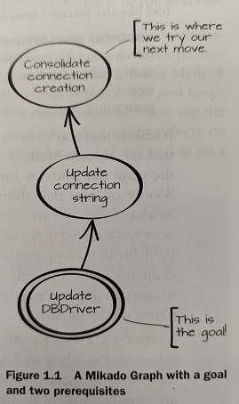

# The Mikado Method

[Copyright: [The Mikado Method](https://www.manning.com/books/the-mikado-method), by [Ola Ellnestam](https://ellnestam.wordpress.com/) 
               and [Daniel Brolund](https://twitter.com/danielbrolund)]

## Summary
The Mikado Method is a framework that helps you visualize, plan, and perform 
business value-focused refactorings over iterations and increments. This 
framework can be applied for individual or team-work! 

## Four Basic Concepts 
The Mikado Method consists of the following four major concepts: 

### Set a Goal
Two things need to be defined when setting a Goal, the state to be reached in 
the future, and the code that needs to be changed for that purpose. In other 
words, you are defining the start and end point of your change. 

### Experiment 
Experiments are used to validate a hypothesis. With a complex and big codebase, 
it is hard to know the impact of a small change on the system. That is why,
leverage on this step to make the change and observe what parts of your 
system breaks down!

By doing so, you can identify the pre-requisites needed to achieve your goal.

In practice, experiments are like [Scratch Refactoring](https://www.goodreads.com/book/show/44919.Working_Effectively_with_Legacy_Code).
Try to code your change, and see what errors you get:

* what does not build
* which tests don't pass

### Visualize 
Visualization is accomplished by writing down the goal and pre-requisites from
previous steps in a Mikado graph format.

Below is an example taken from the book (The Mikado Method) 

[Copyright: [The Mikado Method](https://www.manning.com/books/the-mikado-method)]

### Undo  
After visualizing a Mikado Graph, you should revert your changes to get back to
the previous working state.

Then recurse the process with each prerequisite!

## Unroll the changes
At some point the Mikado Graph will stop to grow. Changes at the leaves don't
have pre-requisites, so they can be done. The process to reach the initial goal
is simply:

1. pick a leaf change
2. do it
3. commit, integration, deploy it
4. repeat

### Dynamic Graphs
Quite often, you'll find new pre-requisite as you'll try to do a change. That's
not a problem. Simply update the graph, undo your change, and continue.

## See it yourself

(The demo is 7 minutes between 12:25 and 19:30, and it's viewable at x1.5 speed by [David Tanzer](https://www.davidtanzer.net/))

(This video is of one of the sessions by [Philippe Bourgau](https://philippe.bourgau.net/) at CPP FRUG in Paris)

## Different scales

We can apply the concepts of the Mikado Method at different scales. We can
stick very close to the code, and build a very precise change graph. This works
particularly well with static-type languages.

We can also build a graph with at a higher level, which leaves out a lot of
details.

Finally, we can even apply the method to process improvements, where it becomes
very similar to [Toyota's Improvement Kata](https://en.wikipedia.org/wiki/Toyota_Kata#The_Improvement_Kata).

## References 
1. [The Mikado Method](https://www.manning.com/books/the-mikado-method), by [Ola Ellnestam](https://ellnestam.wordpress.com/) 
1  and [Daniel Brolund](https://twitter.com/danielbrolund)
1. [Working Effectively with Legacy Code](https://www.r7krecon.com/legacy-code), by [Michael C. Feathers](https://www.r7krecon.com/)
1. [Mikado Method for Legacy Code](https://www.youtube.com/watch?v=qvlkyJ26PGc), by [David Tanzer](https://www.davidtanzer.net/)
1. [Live Coding de Refactoring - Philippe Bourgau - French Version](https://www.youtube.com/watch?v=Xp7YeQsV9L4), by [Philippe Bourgau](https://philippe.bourgau.net/)