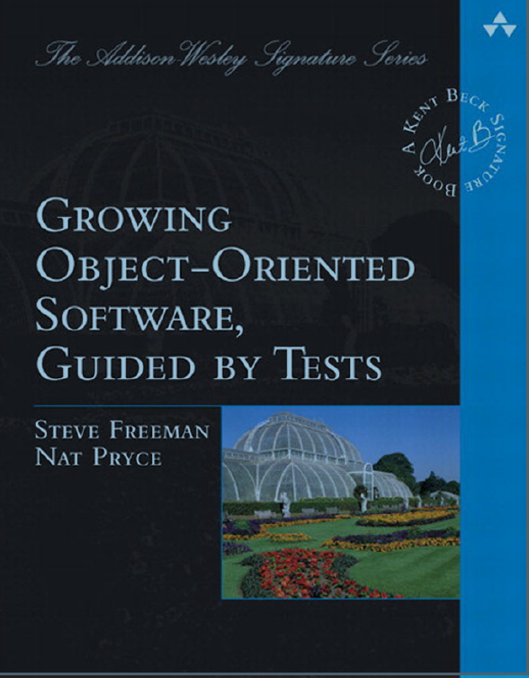

# Test Data Builders

## Summary

'Test Data Builders' is technique that leverages on the [Builder Pattern](https://en.wikipedia.org/wiki/Builder_pattern#Java) 
to construct complex objects in tests.  
With 'Test Data Builders' we can omit fields or properties that do not 
contribute to the behavior of the object being tested.  
A test data builder class has the following features: 

1. A field for each constructor parameter 
1. The fields are initialized to a default safe value
1. Fluent public methods to override the default values
1. A 'build' method that returns an instance of object initialized with 
the fields' values. 

## Examples

Below is an example of a TestBuilder for the Country object from our code:

    import static com.murex.tbw.domain.country.Currency.US_DOLLAR;
    import static com.murex.tbw.domain.country.Language.ENGLISH;
    
    public class CountryTestBuilder {
        private String name = "";
        private Currency currency = US_DOLLAR;
        private Language language = ENGLISH;
    
        public static CountryTestBuilder aCountry() {
            return new CountryTestBuilder();
        }
    
        public CountryTestBuilder withName(String name) {
            this.name = name;
            return this;
        }
    
        public CountryTestBuilder withCurrency(Currency currency) {
            this.currency = currency;
            return this;
        }
    
        public CountryTestBuilder withLanguage(Language language) {
            this.language = language;
            return this;
        }
    
        public Country build() {
            return new Country(name, currency, language);
        }   
    }

By using the above builder, we can now easily create an a country instance 
for France with this code: 
> Note that using the static imports made our code even clearer     

    import static com.murex.tbw.domain.country.Currency.US_DOLLAR;
    import static com.murex.tbw.domain.country.Language.ENGLISH;
    
    @Test
    public void test() {
        Country france = CountryTestBuilder.aCountry()
                .withName("France")
                .withCurrency(EURO)
                .withLanguage(FRENCH)
                .build();
    }

## Benefits

Mainly, Test Data Builders helps us create tests that are expressive and 
more resilient to change. Test Data Builders achieve this by: 

1. Wrapping up most of the syntax noise when creating new objects 
1. Making the default case simple, and special cases not much complicated
1. Protecting tests against changes in the object structure. Existing tests
will not fail if new fields were added to existing objects.
1. Making test code more readable and easier to spot the errors
1. Removes a lot of duplication between tests 
1. Makes writing new tests easier 

## Advanced Usage 

### Creating Similar Objects 
Test Data Builders can help creating similar objects in a cleaner way. 

For example, assume we want to create country instances for France and Germany. 
Knowing that both have Euro as a currency, we can do the following: 

    import static com.murex.tbw.domain.country.Currency.US_DOLLAR;
    import static com.murex.tbw.domain.country.Language.ENGLISH;
    
    @Test
    public void test() {
        CountryTestBuilder europeCountryBuilder = CountryTestBuilder
                .aCountry()
                .withCurrency(EURO);

        Country france = europeCountryBuilder
                .withName("France")
                .withLanguage(FRENCH)
                .build();

        Country germany = europeCountryBuilder
                .withName("France")
                .withLanguage(GERMAN)
                .build();
    }

In most cases with more complex code, this approach will also help get rid of 
duplicated code in tests!

### Passing Builders as Parameters 

## Variations

### Test Constants
### Dealing with dependencies in constructors with JUnitRules or RAII

inject a fake (cf Working effectively with Legacy Code)
Use something to rollback
These small bricks are compatible with Mikado

### Dealing with cyclic dependencies between objects
