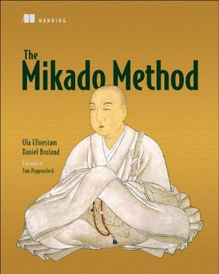

# The Mikado Method

## Summary
The Mikado Method is a framework that helps you visualize, plan, and perform 
business value-focused improvements over iterations and increments. This 
framework can be applied for individual or team-work! 

## Four Basic Concepts 
The Mikado Method consists of the following four major concepts: 

### Set a Goal
Two things need to be defined when setting a Goal, the state to be reached in 
the future and the code that needs to be changed for that purpose. In other 
words, you are will be defining the start and end point of your change. 

### Experiment 
Experiments are used to validate a hypothesis. With complex and big codebase, 
it is hard to know the impact of small change on the system. That is why, in 
this leverage on this step to make the change and observer what pats of your 
system breaks down!   
By doing so, you can identify the pre-requisites needed to achieve your goal.  

### Visualize 
Visualization is accomplished by writing down the goal and pre-requisites from
previous steps in a Mikado graph format. 

Below is an example taken from the book (The Mikado Method) 

### Undo  
After visualizing a Mikado Graph, you should undo your changes to get back to
the previous working state.     
This process is followed for each prerequisite!

## References 
1. [The Mikado Method](https://www.manning.com/books/the-mikado-method)